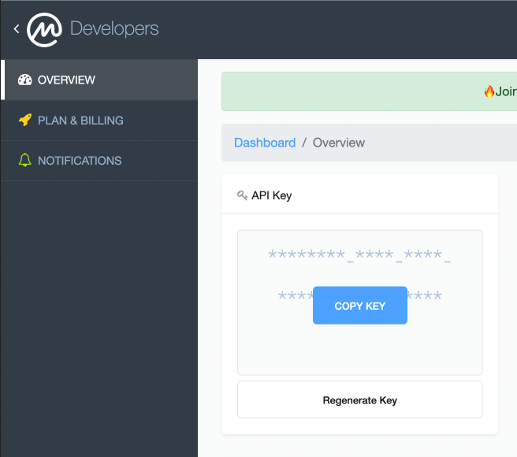
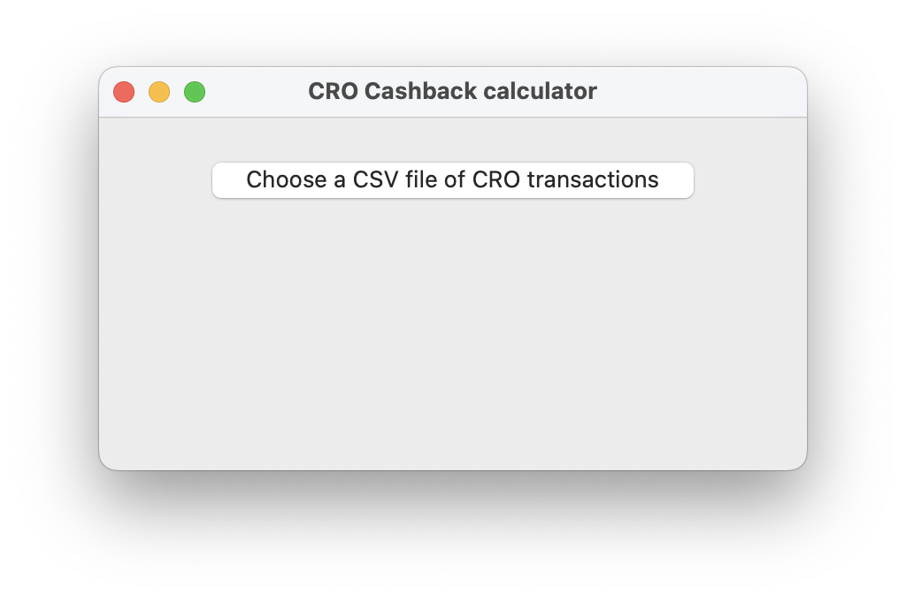

# 🪄 CROCashbackCalcultator
The CROCashbackCalcultator is a tool to know how many [Cronos](https://coinmarketcap.com/fr/currencies/cronos/) you earn by using your Crypto.com Visa card and by refunding your Spotify, Netflix and Amazon Prime.<br>

## 🛠 Prerequisite

To build and use this application you must have [Python 3.9](https://www.python.org/downloads/) or newer.
If you want to know the current value of your earning you must login or create an account on [pro.coinmarketcap.com](https://pro.coinmarketcap.com/) to get your API KEY.

To find your API key once you are login on pro.coinmarketcap.com go on the overview screen :



On the section API key click on `COPY KEY`


## ⚙️ Installation and configuration

Clone this repository on your computer, after that you must have those files :

```
📦 CROCashbackCalcultator
 ┣ 📂ReadMeAssets
 ┣ 📜requirements.txt
 ┣ 📜.gitignore
 ┣ 📜.env
 ┣ 📜README.md
 ┗ 📜run.py
```

Open the file `.env` to configue the tool

```
DIR_PATH = # Enter the path of the folder you wan't the tool open first 
             where you store your CSV files. example : "/folder/CSVfolder"
             IMPORTANT : This example mean C:/Users/YOUR_USERNAME/folder/CSVfolder
             so if you set nothing default folder will be C:/Users/YOUR_USERNAME

API_KEY = # Paste your API key here as a string example : "myapi12-super546-key879"
            If you don't past your API key you will not know the current value of 
            your earning
CURRENCY = # The fiat currency you want to refer you on "USD" / "EUR"
```
Once you succesfully done your configuration, to install dependencies you just need to open a terminal in the tool folder and use the command :

``pip3 freeze > requirements.txt``

INFORMATIONS : you can also use ``pip freeze > requirements.txt`` it all depend how you had configure yout Python you just must use Python3 version

## 🚀 Run

To run your CROCashbackCalcultator you simply need to run the following command in your terminal 

```python3 run.py```

## 🤷🏼‍♂️ How does it work ?



This will window must appear on your screen you just need to click on ``Choose a CSV file CRO transactions`` and open your CSV file you get from Crypto.com app and enjoy the result.

#### Get CSV file from Crypto.com app

Open Crypto.com app on you mobile (Android/iOS) -> Go to `Acount` menu


Open ``Transaction history`` and click on 


Select an export between two dates after that click on `Export to CSV` and download it on `Export History` section and to finish transfer your file to your computer.